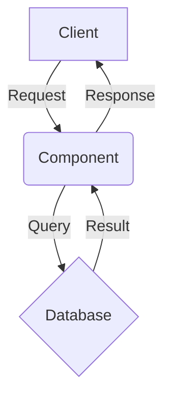

# Runbook: [Component Name]

**Owner:** Forge  
**Last Updated:** YYYY-MM-DD  
**Status:** [Active | Deprecated | In-Dev]

---

## 🏗️ Architecture & Flow
*(Insert Mermaid diagram here matching the implementation)*



## 🚀 How to Run locally

```bash
# Standard dev run
cargo run --bin [binary_name]

# With specific flags
cargo run --bin [binary_name] -- --flag value
```

## 🧪 How to Test

```bash
# Unit tests
cargo test [component_name]

# Integration test
cargo test --test [integration_test_name]
```

## 🔍 Observability & Debugging

**Key Logs:**
- `INFO [component]`: Normal operation
- `WARN [component]`: Recoverable issue (e.g., retry)
- `ERROR [component]`: Requires intervention

**Common Issues:**
1. **Issue:** [Description]
   - **Symptom:** [Log message or behavior]
   - **Fix:** [Step-by-step resolution]

## 🚨 Emergency Procedures

**If [Component] crashes loop:**
1. Stop the service: `pkill [binary_name]`
2. Check logs: `tail -f logs/[file].log`
3. Rollback: `git checkout [stable_tag]`

---

*Generated by Forge for Story NNN.*
