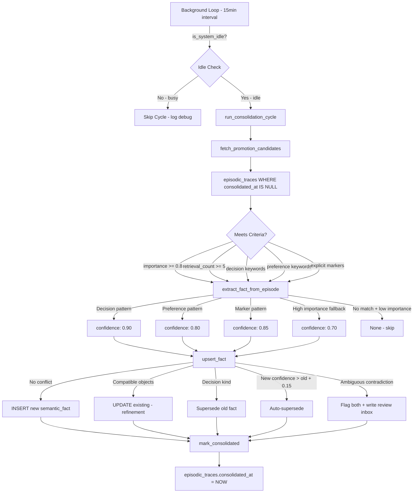

# Runbook 009 — Consolidation Engine

**Story:** 009 — Episodic → Semantic Promotion  
**Component:** `ethos-server/src/subsystems/consolidate.rs`  
**Author:** Forge  
**Date:** 2026-02-23  

---

## Architecture Overview



---

## Background Loop

The consolidation loop runs as a Tokio background task, spawned from `main.rs`:

```rust
tokio::spawn(async move {
    consolidate::run_consolidation_loop(pool, config, conflict_config, decay_config, shutdown).await;
});
```

**Loop behavior:**
- Runs every `consolidation.interval_minutes` (default: 15 minutes)
- Skips cycle if system is not idle (recent session_events OR CPU > threshold)
- Handles shutdown signal gracefully
- After consolidation: triggers decay sweep (Story 010)

### Idle Detection

The system is considered idle when:
1. No session_events in the last `idle_threshold_seconds` (default: 60s)
2. 1-minute CPU load % is below `cpu_threshold_percent` (default: 80%)

---

## Promotion Criteria

An episodic_trace is a promotion candidate if:
- `consolidated_at IS NULL` (not yet processed)
- `pruned = false`
- AND any of:
  - `importance >= 0.8`
  - `retrieval_count >= 5`
  - Content contains: "decided", "let's go with", "the plan is", "we'll use", "going with"
  - Content contains: "prefer", "love", "hate", "always", "never", "favorite"
  - Content contains: "remember this", "note that", "important:"

Max 100 episodes per cycle (prevents overloading on large backlogs).

---

## Fact Extraction (Rule-Based)

No LLM calls. Pure regex/string matching:

| Pattern | Kind | Confidence |
|---------|------|------------|
| "decided to use X", "let's go with X" | decision | 0.90 |
| "X prefers Y over Z", "X loves Y", "X hates Y" | preference | 0.80 |
| "remember this:", "note that:", "important:" | fact | 0.85 |
| High importance (>= 0.8), no keyword match | fact (fallback) | 0.70 |
| Low importance, no keywords | — (skip) | — |

---

## Conflict Resolution

When a fact with the same `subject + predicate` already exists:

| Condition | Resolution | DB Effect |
|-----------|-----------|-----------|
| No existing fact | Insert | New row |
| Objects compatible (one contains other) | Refinement | UPDATE existing, append object |
| New fact is kind=decision | Supersession | INSERT new, set `existing.superseded_by = new.id` |
| New confidence > existing + 0.15 | Auto-supersede | INSERT new, set `existing.superseded_by` |
| Ambiguous (small confidence delta) | Flag | INSERT both with `flagged_for_review = true`, write inbox |

---

## Manual Trigger

Via IPC (EthosRequest::Consolidate):

```bash
# Using the ethos client (if available)
echo '{"action":"consolidate","session":null,"reason":"manual test"}' | \
  nc -U /tmp/ethos.sock | jq .
```

Response:
```json
{
  "status": "ok",
  "data": {
    "triggered": true,
    "episodes_scanned": 12,
    "episodes_promoted": 7,
    "facts_created": 5,
    "facts_updated": 1,
    "facts_superseded": 1,
    "facts_flagged": 0
  }
}
```

---

## Memory Review Inbox

Conflicting facts that cannot be auto-resolved are written to:
`~/.openclaw/shared/inbox/michael-memory-review.md`

Format:
```markdown
### [2026-02-23T09:00:00Z] Memory Conflict
**Subject:** Michael / **Predicate:** prefers
**Existing ID:** abc123...
**New:** "Michael prefers Python" (confidence: 0.75)
**Source episode:** def456...
Actions: `keep-old` | `keep-new` | `keep-both`
```

---

## Configuration

In `ethos.toml`:
```toml
[consolidation]
interval_minutes = 15
idle_threshold_seconds = 60
cpu_threshold_percent = 80
importance_threshold = 0.8
repetition_threshold = 3
retrieval_threshold = 5

[conflict_resolution]
auto_supersede_confidence_delta = 0.15
review_inbox = "~/.openclaw/shared/inbox/michael-memory-review.md"
```

---

## Database Impact

**Reads:**
- `episodic_traces` (WHERE consolidated_at IS NULL, LIMIT 100)
- `session_events` (idle detection, COUNT in last N seconds)
- `semantic_facts` (conflict detection, per subject+predicate)

**Writes:**
- `episodic_traces.consolidated_at = NOW()` (on promotion)
- `semantic_facts` (INSERT, UPDATE, superseded_by flag)
- `semantic_facts.flagged_for_review = true` (on conflict)

**Key Indexes Used:**
- `idx_episodes_unconsolidated` (partial index: WHERE consolidated_at IS NULL)
- `idx_facts_subject_pred` (conflict detection)

---

## Observability

Log messages to watch:
```
INFO Consolidation loop started (interval: 15min)
DEBUG Consolidation skipped: system not idle
INFO Consolidation cycle complete: 8 scanned, 5 promoted, 4 facts created
WARN Failed to upsert fact for episode <id>: ...
INFO Consolidation loop shutting down
```

---

## Runbook: Common Issues

### "Consolidation never runs"
1. Check: Is the system idle? Query `SELECT COUNT(*) FROM session_events WHERE created_at > NOW() - INTERVAL '1 minute'`
2. Check: Is CPU load under 80%? Run `cat /proc/loadavg`
3. Check: Is the server running? `ps aux | grep ethos-server`

### "Facts not being created"
1. Check episodes exist: `SELECT COUNT(*) FROM episodic_traces WHERE consolidated_at IS NULL`
2. Check importance: `SELECT id, importance, content FROM episodic_traces WHERE consolidated_at IS NULL ORDER BY importance DESC LIMIT 10`
3. If all importance < 0.8 with no keywords, no facts will be extracted (expected behavior)

### "Too many flagged facts"
1. View review inbox: `cat ~/.openclaw/shared/inbox/michael-memory-review.md`
2. Review and resolve manually
3. Consider increasing `auto_supersede_confidence_delta` if false positives are common

---

## Testing

```bash
# Unit tests
cargo test subsystems::consolidate

# All tests
cargo test -- --test-threads=1

# Coverage
cargo tarpaulin --out Stdout -- --test-threads=1
```

---

## Files Modified

| File | Change |
|------|--------|
| `ethos-server/src/subsystems/consolidate.rs` | Full implementation (replaced stub) |
| `ethos-server/src/main.rs` | Spawn background consolidation loop |
| `ethos-core/src/config.rs` | Added `ConflictResolutionConfig`, `DecayConfig`, `Default` for `ConsolidationConfig` |
| `Cargo.toml` | Added: `regex`, `num_cpus`, `shellexpand` |
| `ethos-server/Cargo.toml` | Added: `regex`, `num_cpus`, `shellexpand` |
