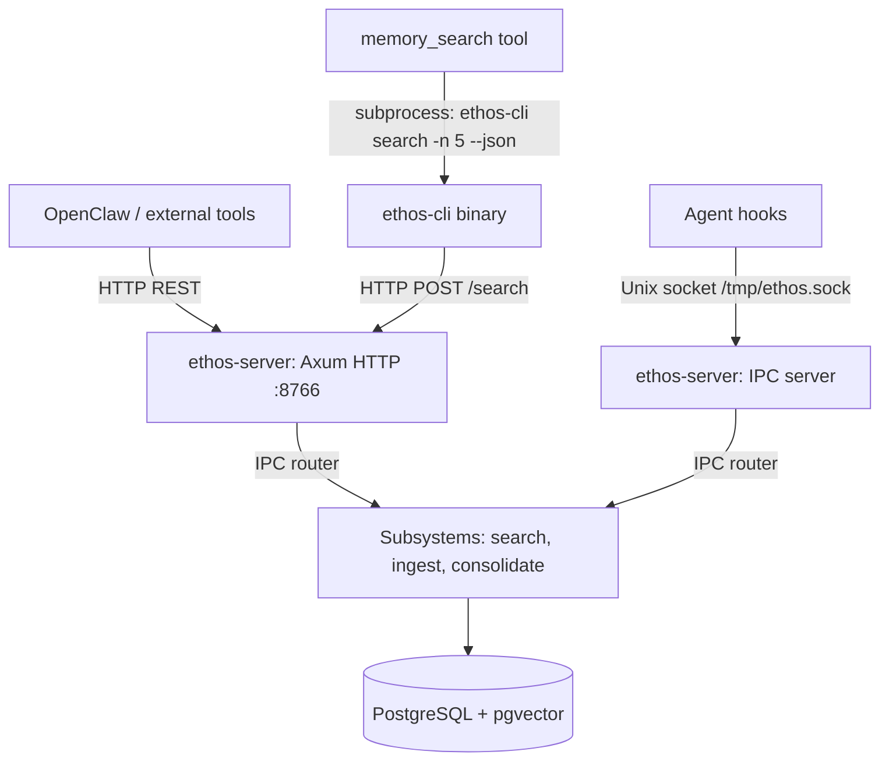

# Runbook 011 — Ethos HTTP REST API + QMD Wire Protocol

**Story:** 011  
**Status:** Shipped  
**Assigned:** Forge  
**Date:** 2026-02-23

---

## Overview

Story 011 adds two capabilities to Ethos:

1. **HTTP REST API** — Axum HTTP server (default port 8766) that exposes Ethos search and ingest over HTTP, enabling external tools and dashboards to query Ethos without Unix socket access.

2. **`ethos-cli` binary** — QMD wire-protocol-compatible CLI binary. Drop-in replacement for the `qmd` command so OpenClaw's `memory_search` tool routes through Ethos semantic search instead of QMD's BM25.

After this story, Ethos is fully queryable from the browser/network layer, and `memory_search` can be transparently upgraded to semantic + spreading-activation retrieval.

---

## Architecture



**Key design decisions:**
- HTTP server and IPC server share the same DB pool and shutdown signal
- HTTP handlers delegate to `crate::router::handle_request_with_config` (no code duplication)
- Handler business logic extracted into `*_inner` functions for testability
- `ethos-cli` uses `reqwest::blocking` (simpler for a subprocess-style CLI)

---

## Files Changed

| File | Change |
|------|--------|
| `ethos-core/src/config.rs` | Added `HttpConfig` struct + `http` field in `EthosConfig` |
| `ethos-server/src/http.rs` | **Created** — Axum HTTP server with 5 endpoints |
| `ethos-server/src/lib.rs` | Added `pub mod http;` |
| `ethos-server/src/main.rs` | Spawns HTTP server alongside IPC server |
| `ethos-server/Cargo.toml` | Added `axum = "0.7"`, `tower` dev-dependency |
| `ethos-cli/Cargo.toml` | **Created** — new crate |
| `ethos-cli/src/main.rs` | **Created** — QMD wire protocol CLI |
| `Cargo.toml` | Added `ethos-cli` to workspace members |
| `ethos.toml` | Added `[http]` section |
| `ethos.toml.example` | Added `[http]` section |
| `ethos-server/tests/http_integration.rs` | **Created** — 10 integration tests |

---

## Configuration

Add to `ethos.toml`:

```toml
[http]
enabled = true
host = "127.0.0.1"
port = 8766
```

- `enabled` — set to `false` to disable the HTTP server (IPC server continues to work)
- `host` — bind address (use `0.0.0.0` to expose on all interfaces — only do this behind a firewall)
- `port` — HTTP port (default 8766)

---

## HTTP Endpoints

### GET /health

Returns server health including DB status.

```bash
curl http://127.0.0.1:8766/health
```

Response:
```json
{
  "status": "healthy",
  "version": "0.1.0",
  "postgresql": "PostgreSQL 17.4",
  "pgvector": "0.8.0",
  "socket": "/tmp/ethos.sock"
}
```

Status codes:
- `200 OK` — healthy
- `503 Service Unavailable` — DB connection failed

### GET /version

```bash
curl http://127.0.0.1:8766/version
```

Response:
```json
{ "version": "0.1.0", "protocol": "ethos/1" }
```

### POST /search

Semantic search with optional spreading activation.

```bash
curl -X POST http://127.0.0.1:8766/search \
  -H "Content-Type: application/json" \
  -d '{"query": "Animus brain regions", "limit": 5, "use_spreading": true}'
```

Request body:
```json
{
  "query": "string (required, non-empty)",
  "limit": 5,
  "use_spreading": false,
  "min_score": 0.12
}
```

Response:
```json
{
  "results": [
    {
      "id": "uuid",
      "content": "The Thalamus acts as gateway...",
      "score": 0.87,
      "source": "user",
      "created_at": "2026-02-22T10:59:00Z",
      "metadata": {}
    }
  ],
  "query": "Animus brain regions",
  "count": 1,
  "took_ms": 43
}
```

Status codes:
- `200 OK` — success (may return empty `results` array if no matches)
- `400 Bad Request` — empty or missing `query` field
- `500 Internal Server Error` — embedding API unavailable or DB error

### POST /ingest

Ingest content into memory.

```bash
curl -X POST http://127.0.0.1:8766/ingest \
  -H "Content-Type: application/json" \
  -d '{
    "content": "The meeting was about Q1 planning.",
    "source": "user",
    "metadata": {
      "session_id": "session-abc123",
      "agent_id": "neko"
    }
  }'
```

Response:
```json
{ "queued": true, "id": "uuid" }
```

### POST /consolidate

Trigger a consolidation cycle manually.

```bash
curl -X POST http://127.0.0.1:8766/consolidate \
  -H "Content-Type: application/json" \
  -d '{"reason": "manual trigger before shutdown"}'
```

Response:
```json
{
  "triggered": true,
  "episodes_scanned": 42,
  "episodes_promoted": 7,
  "facts_created": 5,
  "facts_updated": 2,
  "facts_superseded": 1,
  "facts_flagged": 0
}
```

---

## ethos-cli Binary

### Build & Install

```bash
cd /home/revenantpulse/Projects/ethos
cargo build --release --bin ethos-cli
cp target/release/ethos-cli ~/.local/bin/ethos-cli
```

### Usage

```bash
# Semantic search (human-readable)
ethos-cli search "Animus brain regions" -n 5

# Semantic search (QMD-compatible JSON output)
ethos-cli search "Animus brain regions" -n 5 --json

# Query (alias for search)
ethos-cli query "what is LTP" -n 3 --json

# Server status
ethos-cli status

# Custom server URL
ethos-cli --server http://192.168.1.100:8766 search "test" --json

# Or via env var
ETHOS_HTTP_URL=http://192.168.1.100:8766 ethos-cli search "test" --json
```

### QMD Output Format

When `--json` is passed, output is a JSON array compatible with OpenClaw's QMD parser:

```json
[
  {
    "docid": "#7b5c24",
    "score": 0.87,
    "file": "ethos://memory/7b5c24ab-1234-5678-9abc-def012345678",
    "title": "The Thalamus acts as gateway...",
    "snippet": "@@ -1,4 @@\n\nThe Thalamus acts as gateway to all sensory information..."
  }
]
```

Field mapping from Ethos to QMD:
| QMD field | Ethos source |
|-----------|--------------|
| `docid` | `"#" + first 6 chars of UUID (no dashes)` |
| `score` | Cosine similarity score (0.0–1.0) |
| `file` | `"ethos://memory/{uuid}"` |
| `title` | First non-empty line of `content`, truncated to 60 chars |
| `snippet` | `"@@ -1,4 @@\n\n"` + first 300 chars of `content` |

---

## OpenClaw Integration

To route `memory_search` through Ethos instead of QMD:

1. Build and install `ethos-cli`:
   ```bash
   cargo build --release --bin ethos-cli
   cp target/release/ethos-cli ~/.local/bin/
   ```

2. Update `openclaw.json`:
   ```json
   {
     "memory": {
       "backend": "qmd",
       "qmd": {
         "command": "/home/YOUR_USER/.local/bin/ethos-cli",
         "searchMode": "search"
       }
     }
   }
   ```

3. Restart the OpenClaw gateway:
   ```bash
   openclaw gateway restart
   ```

4. Verify:
   ```bash
   ethos-cli status
   ethos-cli search "test query" --json
   ```

**Fallback behavior:** If `ethos-cli` returns a non-zero exit code or empty results, OpenClaw's QMD manager returns empty results gracefully (no crash). The ethos-context hook (Story 007) continues to work independently via Unix socket.

---

## Operations

### Startup / Shutdown

The HTTP server starts automatically alongside the IPC server when `ethos-server` is launched (if `http.enabled = true`).

Both servers share the same Ctrl+C / SIGTERM shutdown signal (via `tokio::broadcast`). The HTTP server drains active connections gracefully before exiting.

### Health Monitoring

```bash
# Simple health check
curl -f http://127.0.0.1:8766/health || echo "UNHEALTHY"

# In a systemd service, add:
ExecStartPost=/bin/sh -c 'until curl -sf http://127.0.0.1:8766/health; do sleep 1; done'
```

### Logs

The HTTP server logs to stdout via `tracing`. Filter HTTP-specific logs:

```bash
RUST_LOG=ethos_server::http=debug ethos-server
```

Log entries of interest:
- `INFO  ethos_server::http: Ethos HTTP API listening on http://127.0.0.1:8766` — server started
- `INFO  ethos_server::http: HTTP server shutting down...` — graceful shutdown initiated

### Changing the Port

Update `ethos.toml`:
```toml
[http]
enabled = true
host = "127.0.0.1"
port = 9000
```

Restart `ethos-server`. Update `ETHOS_HTTP_URL` env var in any clients.

### Disabling HTTP

```toml
[http]
enabled = false
```

IPC (Unix socket) continues to work. Only the HTTP API is disabled.

---

## Security Notes

- **Default bind: 127.0.0.1** — HTTP API only listens on loopback by default. External access requires changing `host` and exposing through a reverse proxy with authentication.
- **No authentication on HTTP endpoints** — This is intentional for v1 (local-only use). If you expose on a network interface, add nginx/caddy with auth in front.
- **Input validation** — All query strings are validated (empty check). SQL injection is impossible (parameterized queries via sqlx). Content length is controlled by axum's default body size limit (2MB).

---

## Coverage Note

tarpaulin reports lower coverage for `http.rs` than the actual functional coverage due to known limitations in how it instruments async Rust code (generated state machine futures). All 34 Story 011 tests pass. The business logic in `*_inner` functions is exercised by 14 unit tests + 10 integration tests.

---

## Troubleshooting

| Symptom | Cause | Fix |
|---------|-------|-----|
| `address already in use` on port 8766 | Another process (or ethos-server) already bound the port | `lsof -i :8766` to find and stop the process |
| `curl: (7) Failed to connect` | HTTP not enabled or wrong port | Check `http.enabled = true` in ethos.toml and server is running |
| `ethos-cli: connection failed` | ethos-server not running | Start ethos-server; verify with `curl http://127.0.0.1:8766/health` |
| `/search` returns 500 | Embedding API key missing | Set `GEMINI_API_KEY` env var |
| Empty results from `memory_search` | ethos-cli exited with error | Run `ethos-cli search "test" --json` manually; check ethos-server logs |

---

## Testing

Run Story 011 tests:

```bash
# ethos-cli unit tests (10 tests — pure, no DB required)
cargo test -p ethos-cli

# ethos-server HTTP tests (14 unit + 10 integration)
cargo test -p ethos-server 2>&1 | grep -E "(http|test result)"

# Full suite
cargo test
```

---

*Runbook created: 2026-02-23 by Forge*  
*Story: 011 — REST API + QMD Wire Protocol*
